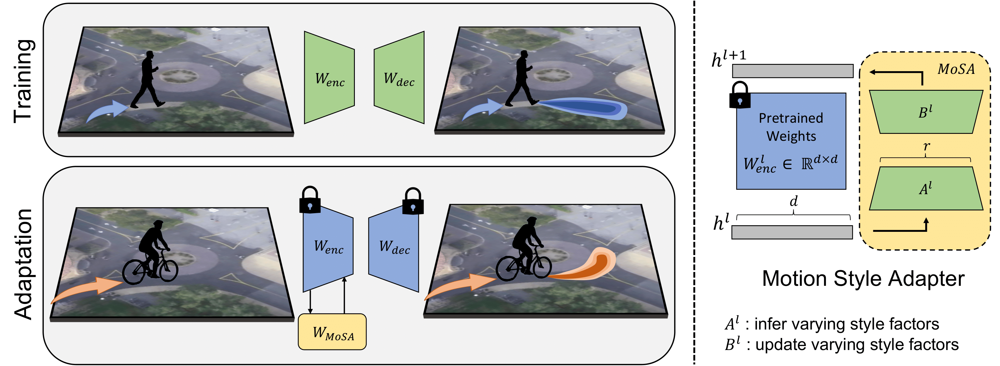

# Motion Style Transfer

**[`Paper`](https://learn-to-race.org/workshop-sl4ad-icml2022/assets/papers/paper_19.pdf) | [`Teaser`](https://drive.google.com/file/d/1f6E4GjVnd006udfVCrU88y0TIm12Ps8u/view?usp=sharing) | [`Video`](https://drive.google.com/file/d/1lkNXW1BbkB6cWD0-3r5gs8w-zoHNwPPj/view?usp=sharing) | [`Poster`](https://drive.google.com/file/d/10JXVbmUOo5BAxeBI4YP5EAxkoHL9AJ19/view?usp=sharing) | [`SDD`](https://github.com/vita-epfl/motion-style-transfer)**

This is an official implementation for the paper

**Motion Style Transfer: Modular Low-Rank Adaptation for Deep Motion Forecasting**
 
*6th Conference on Robot Learning (CoRL), 2022.*
 
<a href="https://thedebugger811.github.io">Parth Kothari*</a>, 
<a href="https://people.epfl.ch/danya.li/?lang=en">Danya Li*</a>, 
<a href="https://sites.google.com/view/yuejiangliu">Yuejiang Liu</a>,
<a href="https://people.epfl.ch/alexandre.alahi/?lang=en/">Alexandre Alahi</a>
 
École Polytechnique Fédérale de Lausanne (EPFL)

## Overview

We propose efficient adaptation of deep motion forecasting models pretrained in one domain with sufficient data to new styles with *limited samples* through the following designs: 

* a low-rank motion style adapter, which projects and adapts the style features at a low-dimensional bottleneck

* a modular adapter strategy, which disentangles the features of scene context and motion history to facilitate a fine-grained choice of adaptation layers

  

## Setup

Install `pipenv` 

After pipenv installation:

`cd l5kit`

`pipenv install --dev -e .`

`pipenv shell`

`cd ..`

## Data Download

Due to License issues, we cannot provide data from the L5Kit dataset. Please follow the [instructions from the L5Kit authors](https://woven-planet.github.io/l5kit/dataset.html) for downloading and setting the path to data directory. 

## Running adaptation scripts (using pre-trained model)

### Get Model

Run: `sh get_pretrained_model.sh`

### Run Script

For Full model finetuning: `make scene_transfer_full_finetune`

For partial model finetuning (last layers): `make scene_transfer_partial_finetune`

For adaptive normalization: `make scene_transfer_adaptive_layernorm`

For motion style adapters (ours): `make scene_transfer_mosa`

 
## Model Pre-training (takes 1 day)

`make pretrain_l5kit`

Note: Larger batchsize speeds up the training process.

## Acknowledgements

Our code is built upon the public code of the following repositories:

* [L5Kit](https://github.com/woven-planet/l5kit)
* [Pytorch Image Models](https://github.com/rwightman/pytorch-image-models)
* [LoRA](https://github.com/microsoft/LoRA)
